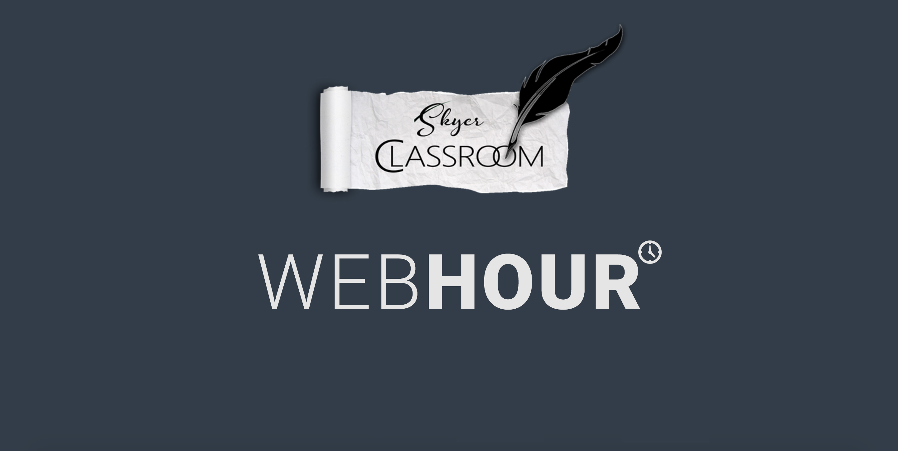

# 

# WEB**HOUR** Syllabus

## Course Overview
This course will focus on helping students understand how the web works, help them acquire the fundamental and thorough knowledge of the 3 foundational languages that power each and every website and learn the design patterns used by the industry. This is a 2 month Course and at the end of this  course each of student will have a fully functional Web App which could be added to their portfolio’s.

## Course Outline

The course is divided into 6 parts:

#### Part 1: HTML, Mockup Designing and Github (2 sessions)
  * Basic HTML Fundamentals and Introduction to HTML5
  * Mockup: How to think about the UI and UX of a Web App.
  * How to use Git and Github.

#### Part 2: Responsive Web Designing (3 sessions)
  * Getting started with CSS, Why Responsive.
  * BOX model, Grid Based Frameworks
  * Bootstrap, Materialize and their components

#### Part 3: JS Programming Language of Web, JQuery, ECMAScript 2015 (4 sessions)
  * Introduction to JS, Adding interactivity to web pages using JS
  * JQuery (JavaScript Made Easy)
  * Working with Future Javascript

#### Part 4: DOM Rendering Process and Website Optimisations (1 sessions)
  * Optimizing Website for faster and smooth performance

#### Part 5: HTTP Requests, Ajax, Promises, 3rd Party APIs (5 sessions)
  * What are Asynchronous Requests, How do they work.
  * Working with $.ajax, JavaScript Promises
  * Introduction to Zomato or any other API for fetching places data.

#### Part 6: Test Driven Programming  (2 sessions)
  * Introduction to Jasmine.
  * UI testing using Jasmine JS.

## WorkFlow
#### Intro ( *Sept 18, 2017* ):
  1. Course Overview
  2. Environment Setup
     - [Brackets](https://github.com/adobe/brackets/releases)
     - [Git](https://git-scm.com/downloads)
  3. [GitHub](https://github.com/) Profile setup.
  4. Intro to GitHub Classroom:
    - Starting with first assignment.
  5. Requesting GitHub [Student Developer Pack](https://education.github.com/pack)

#### Class 1 ( *Sept 19, 2017* ):
  1. Creating and Running `.html` files
  2. Basic about markup languages.
  3. HTML Structure
    - DOCTYPE
    - Markup Tags
      + Head
      + Body
      + Heading
      + Paragraph
      + Table
      + Lists
      + Meta Tags
      + Semantic Tags
    - Attributes
      + src ( *for adding images* )
      + style
    - Paths
      + Absolute
      + Relative
    - Different Type of Tags
      + Inline
      + Block
  4. Assignment (Document2Web)

#### Class 2 ( *Sept 20, 2017* ):
  1. Linking in Web Pages
      - Internal Linking
      - External Linking
  2. Form
      - Input Tags
      - Form Method
  3. Meta Tags

#### Class 3 ( *Sept 21, 2017* ):
  1. What are Repositories
  2. Initialize local Repo using command line git.
  3. Creating First Commit
  4. Intro to GitHub
  5. Linking Local Repo to Remote Github Repo
  6. Making changes to files and pushing changes to GitHub.

#### Class 4 ( *Sept 26, 2017* ):
  1. Working together on same Repo
  2. Handling Conflicts
  3. Branching
  4. Creating PRs

#### Class 5 ( *Sept 27, 2017* ):
  1. Writing Readme's ( *MD Format* )
  2. What is CSS?
  3. How CSS effect HTML?
  4. All about CSS
   - CSS syntax
   - Selectors introduction
       + Simple selectors
        - Element name selector
        - Class selectors
        - Id selector
        - Universal selector
        
       + Attribute selectors
       + Pseudo-classes and pseudo-elements
       + Combinators and multiple selectors
   - CSS values and units
   - Cascade inheritance
  5. What is DOM?
  6. How CSS actually works?
  7. How to apply CSS to our HTML?
  8. Why Responsive?
